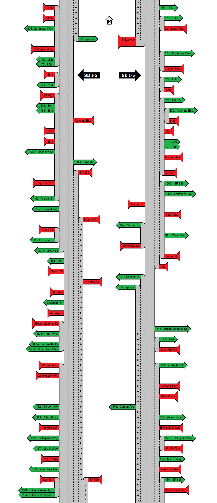

# [Highway Diagrammer](https://github.com/cincodenada/freeway-exits/)
By Joel Bradshaw

Way back in December of 2016, a user who has sadly since deleted their account
created some really neat [simplified][orig] [diagrams][v2] of I-5 through
Seattle and posted them to /r/SeattleWA.

As a big fan of bending data to my will, I looked at the diagram and thought,
*you know, I bet I could generate that from OpenStreetMap data*.

Many weekends and countless hours later I've made some progress, but have much
yet to improve. I've had to hack additional filters into [`osmfilter`][osmc] to
pull out the data I need, and dealt with countless combinations of entrances
and exits, teasing details out of the OSM data that obviously isn't always
organized nicely for this kind of minimalist diagramming.

My first goal is to be able to generate a diagram of I-5 through Seattle that is
virtually identical to the original diagram. From there, I start taking it
elsewhere and find more ways to break it.

Current status is pretty dang messy - the basics are in place and it generates
a diagram, but there are plenty of missing labels and some stub highways, and
the SVG it generates is, uh, far from optimized. It's somewhere between
proof-of-concept and MVP at this point.

But, as of this writing, here's what it generates for the Seattle area, compared
to the original diagram that I'm aiming for, more or less. The only editing I
did here is to chop out the relevant sections of freeway and space them out
sensibly:

Generated | Original
-|-
 |

I also repeated my version full-size down at the bottom.

## License
This project is licensed under [CC-BY-SA 4.0](ccbysa4)

You are free to:
 - Share — copy and redistribute the material in any medium or format
 - Adapt — remix, transform, and build upon the material for any purpose, even
   commercially. 

Under the following terms:
 - Attribution — You must give appropriate credit, provide a link to the
   license, and indicate if changes were made. You may do so in any reasonable
manner, but not in any way that suggests the licensor endorses you or your use.
 - ShareAlike — If you remix, transform, or build upon the material, you must
   distribute your contributions under the same license as the original.
 - No additional restrictions — You may not apply legal terms or technological
   measures that legally restrict others from doing anything the license
permits.
 
OSM data used to generate the images included is licensed under the
[Open Data Commons Open Database License](osmcopy).

## Usage

This is not guaranteed to be up to date, but last time I updated it, this is
how things worked.

You'll need:
 - OSM tools (`osmfilter`, maybe `osmconvert`)
 - Python 3
 - Some OSM data of your choice to extract freeways from
 
If you have some OSM data laying around you can use that! Otherwise there are
various sites to get extracts, or you can download a chunk from JOSM or what
have you. [GeoFabrik](https://download.geofabrik.de/) is an excellent source for
extracts by geographic area.

You'll also need [osmfilter](https://wiki.openstreetmap.org/wiki/Osmfilter),
which the extract script is just a very light wrapper around. If your extract
isn't in a format supported by `osmfilter` (namely, `.osm` or `.o5m`), you'll
need to use `osmconvert` to get it into one of those formats.

For instance, for my reference of I-5 through Seattle, I downloaded the
GeoFabrik extract for [Washington State](waextract), and then converted it to
the proper format with:

```shell
osmconvert washington-latest.osm.pbf --out-o5m > washington.o5m`
```

There are a few extracts needed, this is probably more complicated than it
strictly needs to be and may be simplified eventually but for now, here's what
I got.

```shell
# Optional: create and activate a Python venv
python -m virtualenv -p python3 VENV
source VENV/bin/activate

# Install Python requirements (currently just svgwrite)
pip install -r requirements.txt
# Generate an SVG
./extract.sh washington.o5m
./exits.py --svg out.svg --highway "I 5"
```

And you'll get an (very large, probably inefficient) SVG with a diagram out, if
all goes well! It will probably be missing a lot of entrance labels - see the
next section for ways to mitigate that.

See `--help` for other options available. By default `exit.sh` will output a
bunch of debug to STDERR and a textual representation to STDOUT, both mostly
useful for debugging.

### Auxiliary Nodes

The above will result in a diagram with a lot of missing labels for entrance
ramps, because entrances don't usually have metadata attached to them. To work
around this, there are a couple more scripts to extract the streets that
entrances and exits come from and use them to fill in the missing labels.

Extracting these requires a custom build of osmfilter (I haven't bothered trying
to get my flag upstream yet). The `osmfilter` subrepo has the requisite version
from my fork, and there's a symlink to where the `osmfilter` binary will be
generated. You'll need to build the subrepo:

```shell
cd osmctools
autoreconf --install
./configure
make
```

Then cd back into the root, run the extracts, and then re-run the main script:

```shell
cd ..
./exits.py --dump-nodes > link_nodes
./entrance_nodes.sh washingon.o5m link_nodes
./exits.py --aux-prefix link_nodes --svg out.svg
```

This extract takes a while (the extract for Washington State took several
minutes on my Core i7), because my patches aren't terribly optimized.  I've
deemed it not worth the effort to dig more into `osmfilter.c` to make them so,
because I'd rather just set it running and wait it out. If [osmosis](osmosis) is
installed it will merge all the auxiliary nodes into a single osm file for
checking over in JOSM, etc, but the merged file is not used by the script
itself.

## Contact

The best way to ping me is on [Mastodon](https://cybre.space/@cincodenada) or
[Twitter](https://twitter.com/cincodenada)

## Big Ol' Example Image


[orig]: https://www.reddit.com/r/SeattleWA/comments/5i5ww9/i_get_annoyed_when_i_cant_figure_out_what_lane_i/ "Original post, just southbound"
[v2]: https://www.reddit.com/r/SeattleWA/comments/5ipdkg/another_cool_diagram/ "Improved post, both directions"
[osmc]: https://gitlab.com/osm-c-tools/osmctools "osmctools GitLab"
[waextract]: https://download.geofabrik.de/north-america/us/washington.html
[osmosis]: https://wiki.openstreetmap.org/wiki/Osmosis
[ccbysa4]: https://creativecommons.org/licenses/by-sa/4.0/
[osmcopy]: https://www.openstreetmap.org/copyright
